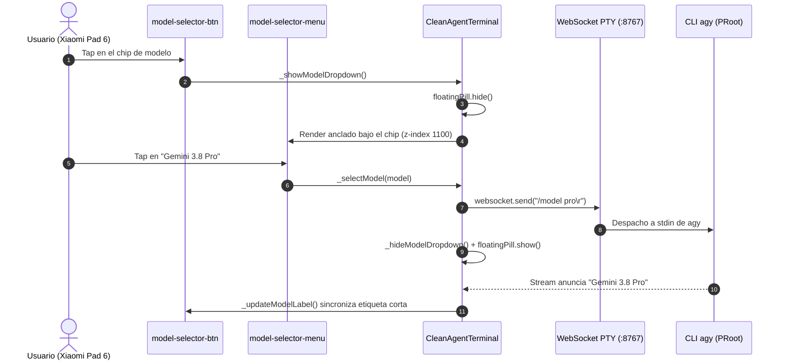

# SPEC-051: Selector de Modelo, Auto-Limpieza del Banner de Arranque y Pulido de la Píldora de Entrada

| Metadato | Valor |
| :--- | :--- |
| **Identificador** | `SPEC-051` |
| **Título** | Selector de Modelo en Top App Bar, Auto-Limpieza del Banner de Arranque y Pulido de la Píldora de Entrada |
| **Autor** | `@ui-designer` |
| **Estado** | `APPROVED FOR IMPLEMENTATION` |
| **Fecha de Creación** | 2026-09-16 |
| **Versión de Release** | `v2.6.0` (VersionCode: `20600`) |
| **Artefacto Binario Target** | `GoogleAntigravity-v2.6.0-ARM64.apk` ($\le 42.0\,\text{MB}$) |
| **Dispositivo Objetivo** | Xiaomi Pad 6 (Qualcomm Snapdragon 870, ARM64-v8a, 6-8 GB RAM, 11" 2.8K $2880\times 1800$, 144Hz, Xiaomi HyperOS / Android 13/14) y Ecosistema Android Móvil (API 26+) |
| **Runtime Target** | Cordova Android WebView / PRoot Linux Sandbox / AXS PTY Daemon (puerto 8767) / Xterm.js v5+ / Google Antigravity CLI (`agy`) |
| **Módulos Afectados** | `nova-src/src/antigravity2/CleanAgentTerminal.js`, `nova-src/src/antigravity2/FloatingInputPill.js`, `nova-src/src/antigravity2/clean-terminal.scss`, `nova-src/config.xml`, `nova-src/package.json`, `harness/test_clean_agent_terminal.sh` |

---

## 1. Contexto y Objetivos

La versión `v2.5.0` consolidó la Top App Bar de 48px (SPEC-048) y la Píldora de Entrada Flotante (SPEC-050). Persisten tres carencias de experiencia en la Xiaomi Pad 6:

1. **Sin conmutación de modelo.** El modelo activo solo es legible dentro del `AccountMenuModal` y no es conmutable sin teclear `/model` a mano en la consola.
2. **Banner de arranque intrusivo.** `agy` emite un banner ASCII del prisma más metadatos técnicos (versión del CLI, email, modelo, workspace) que delata la naturaleza de consola del producto y desperdicia altura útil.
3. **Píldora sin conciencia del IME.** La píldora está anclada con `bottom: fixed` y queda sepultada bajo el teclado virtual de Android al enfocarse.

Esta especificación cubre las tres. El flujo de onboarding, la autenticación OAuth y la lógica del WebSocket PTY preservan íntegros sus contratos.

---

## 2. Arquitectura de la Solución



---

## 3. Contratos de Interfaz

```javascript
// Catálogo de modelos despachables (MODEL-01)
const AGY_MODELS = [
    { id: "flash",      label: "Gemini 3.8 Flash",      command: "/model flash\r" },
    { id: "pro",        label: "Gemini 3.8 Pro",        command: "/model pro\r" },
    { id: "flash-lite", label: "Gemini 3.8 Flash Lite", command: "/model flash-lite\r" },
];

// Detección del modelo activo en el flujo PTY (MODEL-05).
// El orden de alternancia es NORMATIVO: "Flash Lite" precede a "Flash", pues de lo
// contrario la alternancia cortocircuita y "Gemini 3.8 Flash Lite" se trunca a
// "Gemini 3.8 Flash", rotulando el chip con el modelo equivocado.
const MODEL_STREAM_REGEX = /Gemini\s+[\d.]+\s+(?:Flash Lite|Flash|Pro)(?:\s+\([^)]*\))?/i;

// Prompt interactivo de agy listo (CLEAR-01).
// El lookahead negativo es NORMATIVO: descarta los menús numerados del onboarding
// ("> 1. Google OAuth"), que también comienzan por "> " y consumirían el disparo
// one-shot antes de que el banner llegue a imprimirse.
const AGY_PROMPT_READY_REGEX = /^>(?:\s*$|\s(?!\s*\d+\.))/m;

// Superficie añadida a CleanAgentTerminal
class CleanAgentTerminal {
    _renderModelSelector() {}   // Enlaza el chip de la Top App Bar
    _showModelDropdown() {}     // Despliega el menú + oculta la píldora
    _hideModelDropdown() {}     // Repliega el menú + restituye la píldora
    _selectModel(model) {}      // Despacha model.command al PTY
    _shortModelName(full) {}    // "Gemini 3.8 Flash Lite (High)" -> "Flash Lite"
    _updateModelLabel(full) {}  // Sincroniza el texto del chip
}

// Superficie añadida a FloatingInputPill
class FloatingInputPill {
    _attachViewportTracking() {}  // Suscribe visualViewport resize + scroll
    _detachViewportTracking() {}  // Desuscribe (invocado incondicionalmente en dismiss)
}
```

---

## 4. Criterios de Aceptación Verificables

| Identificador | Módulo | Criterio / Requisito | Método de Verificación |
| :--- | :--- | :--- | :--- |
| `AC-MODEL-001` | `CleanAgentTerminal.js` | Catálogo `AGY_MODELS` con los tres modelos (`flash`, `pro`, `flash-lite`) y sus comandos `/model <id>\r` terminados en retorno de carro. | Inspección estática del módulo. |
| `AC-MODEL-002` | `CleanAgentTerminal.js` / SCSS | El `top-bar-left` contiene `#model-selector-btn` con `#model-selector-label` y chevron SVG. Estilo: `border-radius: 16px`, `padding: 4px 10px`, `font-size: 12px`, `color: #8ab4f8`. | Comprobación de markup y reglas SCSS. |
| `AC-MODEL-003` | `CleanAgentTerminal.js` / SCSS | El menú se despliega bajo el chip con `background: #1e2332`, `border-radius: 12px`, `box-shadow: 0 8px 32px rgba(0,0,0,0.5)` y `z-index: 1100`. Un scrim a pantalla completa lo cierra al tocar fuera. | Inspección de `_showModelDropdown` y SCSS. |
| `AC-MODEL-004` | `CleanAgentTerminal.js` | Seleccionar un modelo envía `model.command` por el WebSocket cuando está `OPEN` y repliega el menú. | Inspección de `_selectModel`. |
| `AC-MODEL-005` | `CleanAgentTerminal.js` | El chip refleja el modelo anunciado por el stream PTY en forma corta (`Flash`, `Pro`, `Flash Lite`). `Flash Lite` NO debe degradarse a `Flash`. | Prueba de regex sobre corpus de stream. |
| `AC-MODEL-006` | `CleanAgentTerminal.js` | La píldora se oculta mientras el menú está abierto y se restituye al cerrarlo. | Verificación de llamadas `hide()` / `show()`. |
| `AC-CLEAR-001` | `CleanAgentTerminal.js` | Bandera one-shot `_hasAutoCleared` en el constructor. Al primer prompt listo de `agy` (con onboarding superado) se invoca `terminal.clear()` tras 100ms, purgando el banner de arranque. | Inspección de `_handleAutoResponderStream`. |
| `AC-CLEAR-002` | `CleanAgentTerminal.js` | `restartSession()` rearma `_hasAutoCleared = false`, habilitando la purga en la sesión siguiente. | Inspección de `restartSession`. |
| `AC-PILL-009` | `FloatingInputPill.js` | Suscripción a `visualViewport` (`resize` + `scroll`) que reancla la píldora sobre el teclado virtual con offset mínimo de 16px más `env(safe-area-inset-bottom)`. | Inspección estática del componente. |
| `AC-PILL-010` | `FloatingInputPill.js` / SCSS | `dismiss()` desuscribe ambos listeners de forma incondicional (sin fuga si `containerEl` ya es nulo). Transición de entrada `0.25s cubic-bezier(0.4, 0, 0.2, 1)` más `bottom 0.15s ease`. | Inspección de `_detachViewportTracking` y SCSS. |
| `AC-PILL-011` | `clean-terminal.scss` | Regla `:focus-within` con `border-color: rgba(138, 180, 248, 0.35)` y halo `0 0 0 1px rgba(138, 180, 248, 0.15)`. | Comprobación de reglas SCSS. |
| `AC-UIX-001` | Global | Cero emojis en todo el código de producción: exclusivamente SVG vectorial. | Barrido estático de rangos Unicode de emoji. |
| `AC-HARNESS-001` | Harness Suite | Compuertas automatizadas en `test_clean_agent_terminal.sh` cubriendo SPEC-051 completo. | Ejecución del script de verificación estática. |
| `AC-BUILD-001` | Build System | Versión formal `2.6.0` (versionCode `20600`), compilación limpia y empaquetado de `GoogleAntigravity-v2.6.0-ARM64.apk` ($\le 42.0\,\text{MB}$). | Verificación de build Gradle y tamaño binario. |

---

## 5. Restricciones y No-Objetivos

- **Cero emojis.** Únicamente iconografía SVG vectorial.
- **Cero dependencias nuevas** de producción.
- **Intocables:** flujo de onboarding, autenticación OAuth y lógica del WebSocket PTY.
- **No-objetivo:** descubrimiento dinámico del catálogo de modelos desde `agy`. `AGY_MODELS` permanece codificado en esta iteración; su hidratación desde el CLI se diferirá a una especificación posterior.
- **Degradación conocida:** en navegadores sin `visualViewport` la píldora conserva el anclaje estático de SPEC-050 sin penalización funcional.
