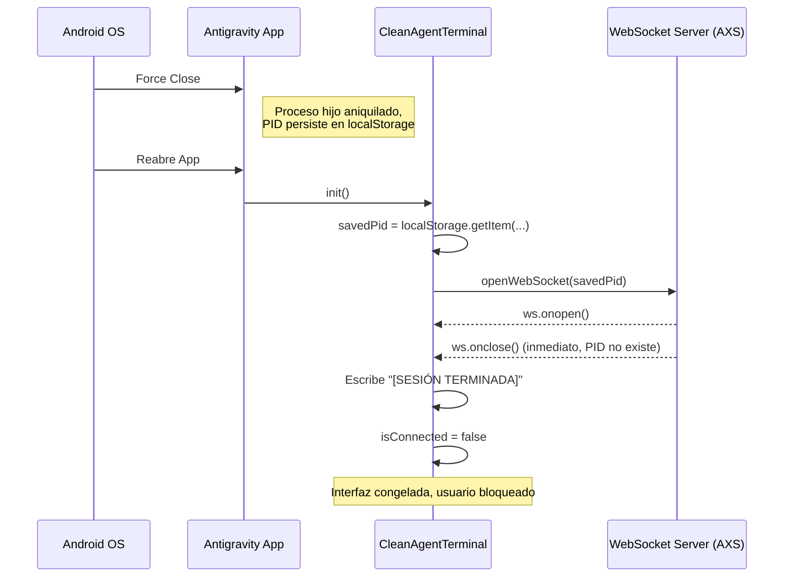
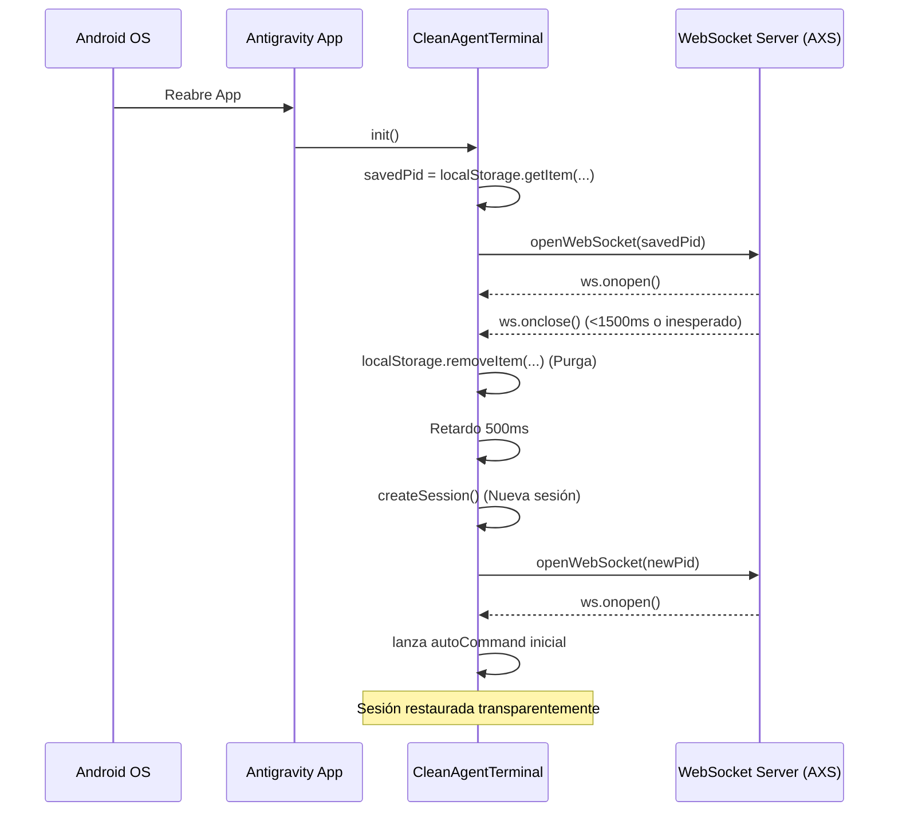

# SPEC-053: Natural Touch Scrolling & Session Auto-Recovery

| Metadato | Valor |
| --- | --- |
| ID | SPEC-053 |
| Título | Natural Touch Scrolling & Session Auto-Recovery |
| Estado | APPROVED FOR IMPLEMENTATION |
| Autor | @spec-architect |
| Fecha | 2026-09-16 |
| Componentes | TerminalTouchNavigation.js, CleanAgentTerminal.js, config.xml, package.json |
| Dispositivo Objetivo | Xiaomi Pad 6 |
| Runtime Target | Kotlin / NDK / PRoot Linux |
| Version Objetivo | 2.7.1 (versionCode 20701) |

## Contexto y Diagnóstico

Durante las pruebas físicas de la versión v2.7.0 en dispositivos táctiles Android (específicamente Xiaomi Pad 6), se han detectado dos incidencias severas en la experiencia de usuario y en el ciclo de vida de la aplicación.

### 1. Inversión de la Dirección del Scroll Táctil
En la SPEC-052 se asumió la metáfora "drag up = scroll up", resultando en la llamada `this.terminal.scrollLines(lines)`. Sin embargo, la física natural de las interfaces táctiles en Android y en general indica que:
- Arrastrar de ARRIBA hacia ABAJO (deltaY > 0) arrastra la "ventana de visión" hacia arriba, por lo que el contenido debe bajar (`scrollLines(-lines)`).
- Arrastrar de ABAJO hacia ARRIBA (deltaY < 0) hace que el contenido suba (`scrollLines(-lines)`).
- El mismo principio aplica al gesto de 2 dedos para el historial de comandos: arrastrar hacia abajo recupera un comando más antiguo (`onArrowUp`), y hacia arriba uno más reciente (`onArrowDown`).

### 2. Bloqueo `[SESIÓN TERMINADA]`
Al cerrar la aplicación forzosamente desde el administrador de tareas de Android y reabrirla, la terminal queda inoperable mostrando: `[SESIÓN TERMINADA] Conexión WebSocket con la terminal cerrada.`
La raíz del problema es que el PID previamente guardado (`savedPid`) sigue en `localStorage`. Al reabrir, el cliente intenta reconectarse a un proceso hijo que fue aniquilado por el sistema operativo, lo que resulta en un cierre inmediato del WebSocket por parte del daemon AXS, dejando al usuario bloqueado sin capacidad de interactuar.

#### Diagrama de Secuencia: Comportamiento Actual (Falla)



#### Diagrama de Secuencia: Comportamiento Propuesto (Auto-Recuperación)



## Contratos de Interfaz

### TerminalTouchNavigation.js
```javascript
// Física Táctil Natural
// Arrastre 1 dedo:
scrollByPixels(deltaY) {
    const lines = Math.round(deltaY / this.lineHeight);
    if (lines !== 0) {
        // Negativo para física natural
        this.terminal.scrollLines(-lines);
        // ...
    }
}

// Arrastre 2 dedos:
if (Math.abs(this.accumulatedTwoFingerDeltaY) > this.swipeThreshold) {
    if (this.accumulatedTwoFingerDeltaY > 0) {
        this.onArrowUp();
    } else {
        this.onArrowDown();
    }
    this.accumulatedTwoFingerDeltaY = 0;
}
```

### CleanAgentTerminal.js
```javascript
// Manejador de cierre de WebSocket mejorado
this.websocket.onclose = (event) => {
    const timeSinceOpen = Date.now() - this.connectionStartTime;
    const isRapidClose = timeSinceOpen < 1500;
    
    // Purgar sesión muerta
    localStorage.removeItem(this.sessionStorageKey);
    
    if (this.intentionalClose) {
        this.terminal.write('\r\n\x1b[31;1m[SESIÓN TERMINADA]\x1b[0m\r\n');
        this.isConnected = false;
        return;
    }
    
    if (isRapidClose && this.reconnectingSavedPid) {
        // Fallo de reenganche de sesión muerta: recuperación silenciosa
        setTimeout(() => {
            this.createSessionAndConnect();
        }, 500);
    } else {
        // Cierre inesperado en medio de la sesión o fallo general
        this.terminal.write('\r\n\x1b[33;1m[CONEXIÓN PERDIDA] Intentando reconectar...\x1b[0m\r\n');
        setTimeout(() => {
            this.createSessionAndConnect();
        }, 500);
    }
};

createSessionAndConnect() {
    this.createSession()
        .then(pid => {
            this.openWebSocket(pid);
            if (this.autoCommand) {
                this.executeCommand(this.autoCommand);
            }
        })
        .catch(err => {
            this.terminal.write(`\r\n\x1b[31;1m[ERROR] Falla al crear nueva sesión: ${err.message}\x1b[0m\r\n`);
        });
}
```

## Criterios de Aceptación

| ID | Criterio de Aceptación | Método de Verificación |
| --- | --- | --- |
| `AC-SCROLL-01` | `scrollByPixels(deltaY)` en `TerminalTouchNavigation.js` debe invocar `this.terminal.scrollLines(-lines)` (signo negativo invertido). | Inspección estática del código. |
| `AC-SCROLL-02` | En gestos de dos dedos, `accumulatedDeltaY > 0` dispara `onArrowUp()` y `< 0` dispara `onArrowDown()`. | Inspección estática del código. |
| `AC-RECOVER-01` | Cierre inesperado del WebSocket en `CleanAgentTerminal.js` purga `localStorage`, espera 500ms, y llama a `createSession()` seguida del relanzamiento del comando. | Inspección estática y ejecución en Android. |
| `AC-RECOVER-02` | Si el WebSocket cierra en `< 1500ms` al reenganchar, se descarta silenciosamente sin mostrar `[SESIÓN TERMINADA]`, y se reinicia el flujo. | Inspección estática y simulación de PID obsoleto. |
| `AC-UIX-01` | Cero uso de emojis en los archivos modificados. | Escaneo RegExp estático de caracteres Unicode fuera del plano básico. |
| `AC-BUILD-01` | Archivos `config.xml` y `package.json` actualizados a versión `2.7.1` (versionCode `20701`). | Inspección estática. |

## Restricciones y No-Objetivos
- **No-Objetivo:** No se implementa la reconexión con "estado completo de terminal" en este ticket. La auto-recuperación inicia una sesión limpia (fresca) cuando la anterior está muerta.
- **Restricción:** El detector de menús interactivos y el scrollbar efímero de 3px implementados en iteraciones previas no deben ser alterados.
- **Restricción:** La lógica de auto-recuperación no debe crear un bucle infinito ("reconnect loop bomb") si el backend está genuinamente caído por completo. Debe existir un límite razonable o el flujo de creación de sesión fallará eventualmente.
