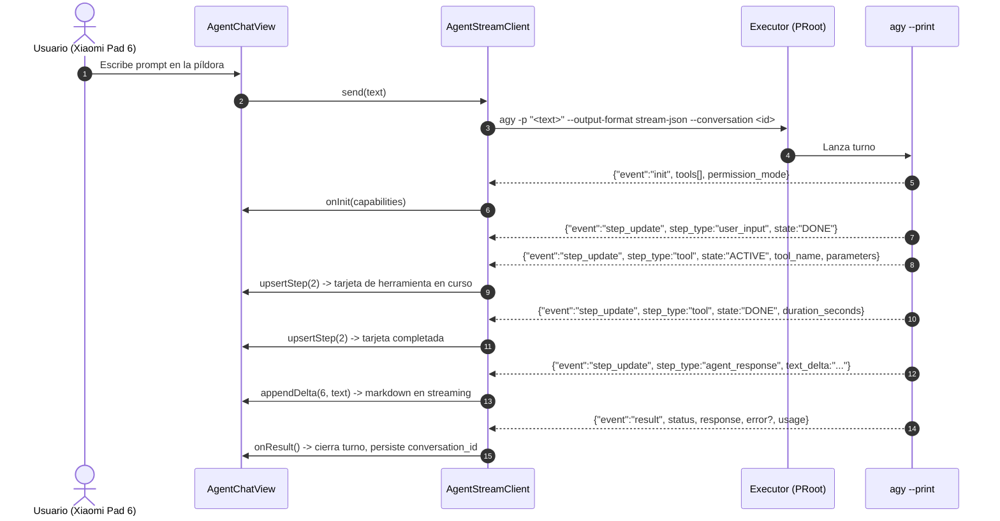

# SPEC-054: Interfaz Nativa de Agente sobre el Protocolo `stream-json` de `agy`

| Metadato | Valor |
| :--- | :--- |
| **Identificador** | `SPEC-054` |
| **Título** | Interfaz Nativa de Agente sobre el Protocolo `stream-json` de `agy` (Erradicación del Raspado de TUI) |
| **Autor** | `@spec-architect` |
| **Estado** | `IMPLEMENTADA — VERIFICACIÓN EN DISPOSITIVO PENDIENTE` |
| **Fecha de Creación** | 2026-09-16 |
| **Versión de Release** | `v2.8.0` (VersionCode: `20800`) |
| **Artefacto Binario Target** | `GoogleAntigravity-v2.8.0-ARM64.apk` ($\le 42.0\,\text{MB}$) |
| **Dispositivo Objetivo** | Xiaomi Pad 6 (Qualcomm Snapdragon 870, ARM64-v8a, 6-8 GB RAM, 11" 2.8K $2880\times 1800$, 144Hz, Xiaomi HyperOS / Android 13/14) y Ecosistema Android Móvil (API 26+) |
| **Runtime Target** | Cordova Android WebView / PRoot Linux Sandbox / AXS PTY Daemon (puerto 8767) / Antigravity CLI (`agy`) 1.2.4 en modo `--print` |
| **Módulos Afectados** | `nova-src/src/antigravity2/AgentStreamClient.js` (nuevo), `nova-src/src/antigravity2/AgentSession.js` (nuevo), `nova-src/src/antigravity2/AgentChatView.js` (nuevo), `nova-src/src/antigravity2/agent-chat.scss` (nuevo), `nova-src/src/antigravity2/CleanAgentTerminal.js`, `nova-src/src/antigravity2/clean-terminal.scss`, `nova-src/config.xml`, `nova-src/package.json`, `harness/fixtures/`, `harness/test_agent_stream_client.sh` (nuevo), `nova-src/tests/unit/agentStreamClient.test.js` (nuevo), `nova-src/tests/unit/agentSession.test.js` (nuevo) |
| **Fixtures Normativas** | `harness/fixtures/agy-print-stream-json.ndjson`, `harness/fixtures/agy-print-stream-json-tools.ndjson`, `harness/fixtures/agy-print-json.json`, `harness/fixtures/agy-help-1.2.4.txt` |

---

## 1. Contexto y Objetivos

### 1.1 El hallazgo

Desde `SPEC-028` la aplicación renderiza `agy` como TUI en Xterm.js y deriva el estado
de la interfaz raspando el stream PTY. Sobre esa base se construyeron veintitrés
especificaciones de mitigación: auto-respondedor de onboarding con seis expresiones
regulares, navegación de menús por emulación de flechas
(`"\x1b[B".repeat(4) + "\r"` para seleccionar un tema), detección del prompt por regex,
velo de onboarding para tapar el TUI durante el login, y auto-limpieza del banner de arranque.

La inspección de `agy --help` en la versión 1.2.4 (2026-09-16) establece que **nada de
eso era necesario**. El CLI expone un modo programático de primera clase:

```
--print / -p         Run a single prompt non-interactively and print the response
--output-format      text, json, stream-json
--input-format       text, stream-json  (una línea NDJSON por turno desde stdin)
--conversation       Resume a previous conversation by ID
--dangerously-skip-permissions
--mode               accept-edits, plan
--effort             low|medium|high
--json-schema        Fuerza salida estructurada
```

`agy` emite eventos NDJSON tipados con deltas de texto incrementales, invocaciones de
herramienta con parámetros, contabilidad de tokens y estado terminal. Es un protocolo de
agente, no una pantalla de terminal.

### 1.2 Objetivo

Renderizar la experiencia de Antigravity con **interfaz nativa sobre eventos
estructurados**, eliminando el raspado de TUI del camino principal.

El objetivo declarado por el usuario —"que no se vea la terminal"— no se alcanza
ocultando Xterm.js. Se alcanza no invocando el TUI: no hay terminal que ocultar cuando el
motor emite JSON y la interfaz lo renderiza.

### 1.3 No-objetivo explícito: no destripar lo que funciona

`CleanAgentTerminal` queda **intacta y operativa** como vista alternativa. La interfaz
nativa se construye en paralelo y se promueve a vista por defecto solo cuando cumpla los
criterios de aceptación. Esto preserva un camino de retorno verificado en dispositivo y
evita una migración de todo-o-nada sobre la única superficie funcional del producto.

---

## 2. Arquitectura de la Solución



### 2.1 Separación de responsabilidades

| Componente | Responsabilidad | Prohibido |
| :--- | :--- | :--- |
| `AgentStreamClient` | Trocear NDJSON, decodificar eventos, mantener el mapa de pasos, armar el argv y la cita de shell | Tocar el DOM, lanzar procesos |
| `AgentSession` | Lanzar `agy` vía `window.Executor`, alimentar el decodificador, sintetizar el resultado si el proceso muere | Tocar el DOM |
| `AgentChatView` | Renderizar pasos como burbujas, tarjetas de herramienta y contadores | Parsear stdout crudo |
| `CleanAgentTerminal` | Vista de terminal existente; solo se le añade el conmutador | Cambiar su comportamiento |

La frontera importa: `AgentStreamClient` es lógica pura y comprobable contra las fixtures
sin navegador. Es la corrección directa del hueco identificado en `harness/fixtures/README.md`.

---

## 3. Contratos de Interfaz

### 3.1 Protocolo de salida (VERIFICADO contra dispositivo)

Tres valores de `event`. Todo evento acarrea `conversation_id`.

**`init`** — una vez por invocación:

```json
{"event":"init","conversation_id":"<uuid>","init":{
  "cwd":"/home/studio/workspace",
  "tools":["ask_permission","list_dir","run_command","write_to_file", "..."],
  "permission_mode":"request-review"
}}
```

`permission_mode` observado: `"request-review"` por defecto, `"always-proceed"` con
`--dangerously-skip-permissions`. 57 herramientas enumeradas en la captura.

**`step_update`** — N veces por turno. Es el evento de renderizado:

```json
{"event":"step_update","step_update":{
  "conversation_id":"<uuid>",
  "step_index": 0,
  "state": "ACTIVE" | "DONE",
  "step_type": "user_input" | "agent_response" | "tool" | "error_message",
  "text_delta": "<fragmento incremental>",
  "tool_name": "list_dir",
  "tool_info": {"name":"list_dir","parameters":{ }},
  "duration_seconds": 0.126659115,
  "usage": {"input_tokens":0,"output_tokens":0,"thinking_tokens":0,
            "cache_read_tokens":0,"total_tokens":0}
}}
```

Semántica de campos, por `step_type`:

| `step_type` | Campos presentes | Renderizado |
| :--- | :--- | :--- |
| `user_input` | solo `state:"DONE"` | Burbuja del usuario (el texto lo conoce la vista, no el evento) |
| `agent_response` **con** `text_delta` | `text_delta` incremental, `usage` en el `DONE` | Markdown en streaming |
| `agent_response` **sin** `text_delta` | `duration_seconds`, `usage` con `thinking_tokens` | Paso de razonamiento interno; indicador de actividad |
| `tool` | `tool_name`, `tool_info.parameters`, `duration_seconds` en `DONE` | Tarjeta de herramienta plegable |
| `error_message` | `state:"DONE"`, `duration_seconds` | Marcador de fallo intermedio |

`step_index` es la clave de agrupación: varios eventos con el mismo índice son
actualizaciones del mismo elemento de la lista, no elementos nuevos.

**`result`** — una vez, terminal:

```json
{"event":"result","result":{
  "conversation_id":"<uuid>",
  "status":"SUCCESS" | "ERROR",
  "response":"<texto final completo>",
  "error":"API error (attempt 1): UNAVAILABLE (code 503): No capacity available for model gemini-3.8-flash-high on the server",
  "duration_seconds": 87.764173821,
  "num_turns": 1,
  "usage": { }
}}
```

`status:"ERROR"` **puede coexistir con `response` útil y completo**. La interfaz debe
renderizar el contenido y señalar el fallo por separado; tratar `ERROR` como "sin
resultado" descartaría trabajo válido. Confirmado en
`agy-print-stream-json-tools.ndjson`, donde un 503 de capacidad acompaña una respuesta
correcta.

### 3.2 Superficie de `AgentStreamClient`

```javascript
export class AgentStreamClient {
    constructor(options = {}) {
        this.onInit = options.onInit || (() => {});
        this.onStep = options.onStep || (() => {});
        this.onResult = options.onResult || (() => {});
        this.onFatal = options.onFatal || (() => {});
        this.conversationId = null;
    }

    // Decodificador puro: acepta un fragmento arbitrario de stdout, tolera
    // límites de línea partidos, despacha eventos completos. Sin DOM.
    ingest(chunk) {}

    // Construye el argv del turno. Reusa conversationId si existe.
    buildArgv(promptText, opts) {}

    send(promptText) {}
    abort() {}
    reset() {}
}
```

### 3.3 Transporte — decisión y justificación

**v1 (esta especificación): un proceso por turno.**

```
agy -p "<prompt>" --output-format stream-json --conversation <id> --print-timeout 15m
```

El `conversation_id` capturado del primer turno se reinyecta con `--conversation`, lo que
preserva el contexto entre invocaciones. Esto depende exclusivamente del esquema
verificado en 3.1.

**v2 (fuera de alcance): proceso persistente.**

```
agy --input-format stream-json --output-format stream-json
```

Un NDJSON por línea a stdin, un turno por línea. Elimina el arranque en frío, medido en
**~13.000 tokens de entrada y 20-22 segundos** en un `"di hola"` trivial — coste que v1
paga en cada mensaje.

v2 queda diferido porque **el esquema de entrada no está documentado**: `agy help print`
responde `Error: unknown subcommand: print`. Especificar v2 sin ese esquema repetiría el
fallo de `SPEC-051`: escribir un contrato contra un formato imaginado.

La migración v1 → v2 no toca la interfaz: los eventos de salida son idénticos. Se
sustituye `buildArgv` por un escritor de stdin y nada más.

---

## 4. Criterios de Aceptación Verificables

| Identificador | Módulo | Criterio / Requisito | Método de Verificación |
| :--- | :--- | :--- | :--- |
| `AC-STREAM-001` | `AgentStreamClient.js` | `ingest()` decodifica las fixtures normativas completas emitiendo la secuencia exacta de eventos esperada. | Test unitario (vitest) contra `harness/fixtures/*.ndjson`. |
| `AC-STREAM-002` | `AgentStreamClient.js` | `ingest()` reconstruye eventos partidos en límite de línea arbitrario: alimentar la fixture byte a byte produce idéntica secuencia que alimentarla de una vez. | Test unitario con troceado aleatorio y semilla fija. |
| `AC-STREAM-003` | `AgentStreamClient.js` | Los `text_delta` de un mismo `step_index` concatenan exactamente el `response` del evento `result`, para contenido sin markdown. | Test unitario sobre `agy-print-stream-json.ndjson` (verificado: coincide). **No exigible** sobre `agy-print-stream-json-tools.ndjson`; ver 5.2. |
| `AC-STREAM-004` | `AgentStreamClient.js` | `status:"ERROR"` con `response` no vacío propaga **ambos**: contenido y error. | Test unitario sobre `agy-print-stream-json-tools.ndjson`. |
| `AC-STREAM-005` | `AgentStreamClient.js` | El `conversation_id` del primer turno se reinyecta como `--conversation` en el argv del turno siguiente. | Test unitario de `buildArgv`. |
| `AC-STREAM-006` | `AgentStreamClient.js` | Una línea malformada o no-JSON se descarta sin abortar el flujo ni perder eventos posteriores. | Test unitario con fixture corrupta inyectada. |
| `AC-VIEW-001` | `AgentChatView.js` | Eventos con `step_index` repetido actualizan el mismo elemento; no se duplican burbujas. | Test de componente con DOM virtual. |
| `AC-VIEW-002` | `AgentChatView.js` | `step_type:"tool"` renderiza tarjeta plegable con `tool_name`, `parameters` y duración; `ACTIVE` muestra actividad, `DONE` la retira. | Test de componente. |
| `AC-VIEW-003` | `AgentChatView.js` | `agent_response` sin `text_delta` no genera burbuja vacía; se refleja como actividad de razonamiento. | Test de componente. |
| `AC-VIEW-004` | `AgentChatView.js` | Markdown renderizado con enlaces `file://` navegables (observados en los deltas reales). | Test de componente. |
| `AC-VIEW-005` | `AgentChatView.js` | Cero Xterm.js en el árbol de la vista nativa. | Inspección estática del módulo. |
| `AC-COEX-001` | `CleanAgentTerminal.js` | La vista de terminal conserva su comportamiento de `v2.7.1` sin regresión. | Ejecución completa de `test_clean_agent_terminal.sh`. |
| `AC-COEX-002` | Global | Conmutador de vista entre interfaz nativa y terminal; la terminal permanece alcanzable. | Verificación en dispositivo. |
| `AC-UIX-001` | Global | Cero emojis: exclusivamente SVG vectorial. | Barrido por rangos de bytes UTF-8. |
| `AC-BUILD-001` | Build System | Versión `2.8.0` (versionCode `20800`), APK $\le 42.0\,\text{MB}$, sin dependencias de producción nuevas. | Build Gradle y medición binaria. |

### 4.1 Nota normativa sobre la verificación

Los criterios `AC-STREAM-*` y `AC-VIEW-*` exigen **aserciones de comportamiento**, no
comprobaciones de presencia. Compuertas del tipo `grep -q "AgentStreamClient"` no
satisfacen ningún criterio de esta especificación.

Esto es deliberado. Las 85 compuertas de `test_clean_agent_terminal.sh` son estáticas, y
`SPEC-051` alcanzó 77/77 en verde con dos de sus tres mejoras rotas en dispositivo.

---

## 5. Restricciones y No-Objetivos

- **Cero emojis.** Solo SVG vectorial.
- **APK $\le 42.0\,\text{MB}$.**
- **Sin dependencias de producción nuevas.** El renderizado de markdown debe usar lo ya
  presente en el bundle o implementarse a medida.
- **Intocables:** el flujo de onboarding OAuth y la persistencia de credenciales en
  `~/.gemini/`. La autenticación ya funciona; esta especificación no la roza.
- **`CleanAgentTerminal` no se modifica funcionalmente.** Solo se le añade el conmutador
  de vista.
- **No-objetivo:** el transporte de proceso persistente (`--input-format stream-json`).
  Diferido hasta que el esquema de entrada esté verificado.
- **No-objetivo:** exponer las 57 herramientas del `init`. La captura revela superficie no
  explotada —automatización de navegador, subagentes, `schedule`, `manage_task`,
  `generate_image`— que corresponde a especificaciones posteriores.
- **No-objetivo:** suprimir el banner de arranque. `CLEAR-01` de `SPEC-051` queda
  **obsoleto por diseño**: la interfaz nativa no invoca el TUI, así que no hay banner.
  En la vista de terminal el criterio sigue sin cumplirse y se documenta como tal.

### 5.1 Riesgos conocidos

| Riesgo | Naturaleza | Mitigación |
| :--- | :--- | :--- |
| El evento `tool` `DONE` **no trae el resultado** de la herramienta | Verificado en fixture | Renderizar invocación y parámetros; el resultado llega narrado en el `agent_response` siguiente. Los diffs sí son reconstruibles desde `parameters` de `write_to_file` / `replace_file_content`. |
| Arranque en frío de ~13k tokens y ~20s por turno | Medido | Aceptado en v1; resuelto por el transporte persistente de v2. |
| 503 `No capacity available` por modelo | Observado en dispositivo | Fallback de modelo mediante el selector de `SPEC-051`, que adquiere aquí su justificación funcional. |
| Protocolo no versionado ni documentado públicamente | Estructural | Revalidar fixtures tras cada actualización de `agy`; fijar la versión del CLI en el corpus. |
| Fixtures transcritas de capturas, no volcadas | **Activo** | Ver `harness/fixtures/README.md`. Sustituir por volcados reales antes de tratar cualquier compuerta como autoritativa. |

### 5.2 Discrepancia abierta en el corpus

La validación de `AC-STREAM-003` contra las fixtures actuales arroja un resultado
divergente entre las dos capturas:

| Fixture | `text_delta` concatenados vs. `result.response` |
| :--- | :--- |
| `agy-print-stream-json.ndjson` | **Coinciden exactamente** |
| `agy-print-stream-json-tools.ndjson` | **No coinciden**: los deltas contienen el enlace markdown ``[`/home/studio/workspace`](file:///home/studio/workspace)`` donde `result.response` trae únicamente `workspace` |

Hipótesis principal: artefacto de transcripción. En la captura, `agy` renderizó
el enlace markdown de su propia salida como texto subrayado y se transcribió la
forma renderizada en lugar del JSON crudo.

Hipótesis alternativa, no descartada: `result.response` aplica una normalización
que los deltas no aplican.

**La distinción es material para el renderer.** Si es normalización real, la
interfaz debe construir el mensaje final desde los deltas y nunca desde
`result.response`, o perderá los enlaces. Queda bloqueada hasta el volcado real.

Este hallazgo salió de ejecutar la verificación del propio criterio antes de
escribir el parser, que es exactamente el orden que `SPEC-051` no siguió.

---

## 6. Dependencia de Bloqueo

La fidelidad del corpus es precondición de `AC-STREAM-001` a `AC-STREAM-006`. Las
fixtures actuales se transcribieron a mano desde capturas de pantalla del dispositivo y
**no son byte-exactas**: el espaciado, el orden de claves y el escapado pueden diferir, y
la lista de `tools` puede tener omisiones.

Sustituirlas por redirecciones a archivo reales es el primer paso de implementación, antes
de escribir el parser. Los comandos exactos están en `harness/fixtures/README.md`.

---

## 7. Estado de Verificación

| Ámbito | Estado |
| :--- | :--- |
| `AgentStreamClient` — decodificación, reensamblado, cita de shell | **Verificado**: 42 aserciones contra el corpus, más 7 argumentos hostiles contra un `sh` real |
| `AgentSession` — ciclo de turno, reinyección de conversación, robustez | **Verificado**: 16 aserciones con doble inyectado del `Executor` |
| Resistencia de la suite a mutaciones | **Verificado**: 6/6 mutaciones del decodificador detectadas |
| Compuertas de SPEC-054 | **Verificado**: 12/12, incluida la anti-regresión de la terminal |
| Build y empaquetado | **Verificado**: `2.8.0` / `20800`, APK 36.84 MB |
| `AgentChatView` — render en pantalla | **NO VERIFICADO.** Nunca se ha ejecutado en dispositivo |
| Conmutación entre vistas | **NO VERIFICADO** en dispositivo |
| `agy` lanzado por `Executor` con `-p` dentro de Alpine | **NO VERIFICADO** en dispositivo |

Las tres últimas filas son la frontera de lo comprobable sin la tablet. El
transporte se probó contra un doble del plugin que reproduce su contrato
documentado, no contra el plugin real; y el renderer no se ha pintado nunca.

Tratar esta especificación como cumplida antes de esa verificación repetiría el
error de `SPEC-051`.
