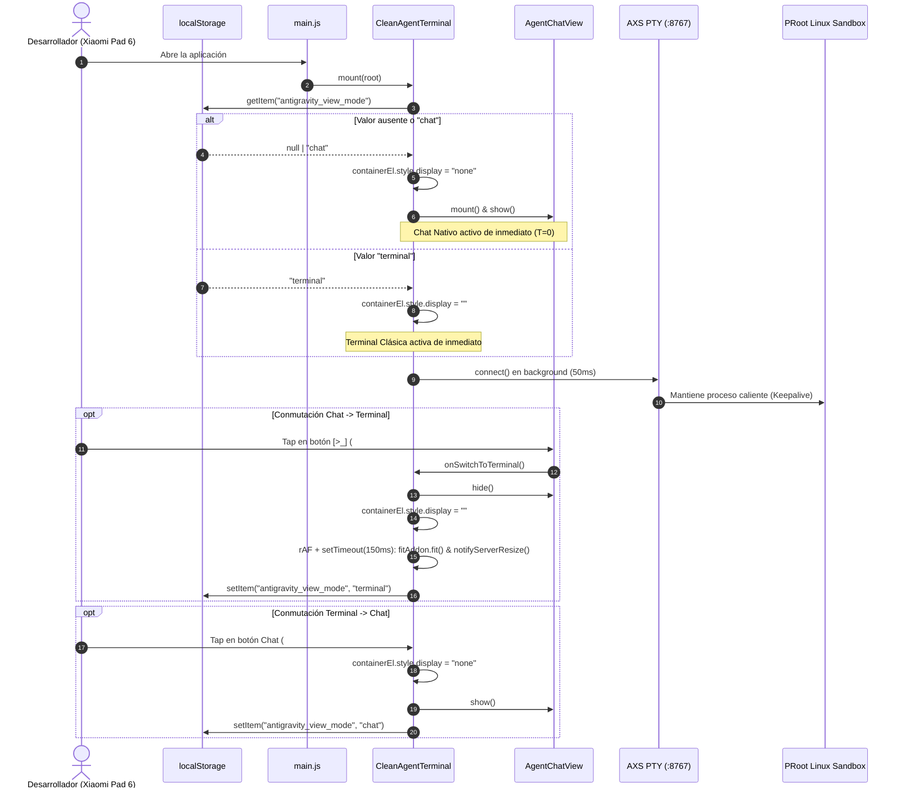

# SPEC-055: Vista de Chat Nativa por Defecto, Conmutación Bidireccional y Persistencia de Modo

| Metadato | Valor |
| :--- | :--- |
| **Identificador** | `SPEC-055` |
| **Título** | Vista de Chat Nativa por Defecto, Conmutación Bidireccional Limpia y Persistencia de Modo de Pantalla |
| **Autor** | `@spec-architect` |
| **Estado** | `APPROVED FOR IMPLEMENTATION` |
| **Fecha de Creación** | 2026-09-16 |
| **Versión de Release** | `v2.9.0` (VersionCode: `20900`) |
| **Artefacto Binario Target** | `GoogleAntigravity-v2.9.0-ARM64.apk` ($\le 42.0\,\text{MB}$) |
| **Dispositivo Objetivo** | Xiaomi Pad 6 (Qualcomm Snapdragon 870, ARM64-v8a, 6-8 GB RAM, 11" 2.8K $2880\times 1800$, 144Hz, Xiaomi HyperOS / Android 13/14) y Ecosistema Android Móvil (API 26+) |
| **Runtime Target** | Cordova Android WebView / PRoot Linux Sandbox / AXS PTY Daemon (puerto 8767) / Antigravity CLI (`agy`) 1.2.4 en modo `--print` y PTY interactivo |
| **Módulos Afectados** | `nova-src/src/antigravity2/CleanAgentTerminal.js`, `nova-src/src/antigravity2/AgentChatView.js`, `nova-src/src/main.js`, `nova-src/config.xml`, `nova-src/package.json`, `nova-src/tests/unit/viewModePersistence.test.js` (nuevo), `harness/test_default_chat_view.sh` (nuevo), `harness/test_clean_agent_terminal.sh` |
| **Especificaciones Previas** | [SPEC-028](file:///c:/Projects/antigravity/specs/28-minimal-agent-terminal-clean-apk.md) (Clean Terminal), [SPEC-040](file:///c:/Projects/antigravity/specs/40-premium-zero-leak-transition-and-session-persistence.md) (Session Persistence), [SPEC-048](file:///c:/Projects/antigravity/specs/48-top-app-bar-and-input-pill-anti-collision.md) (Dedicated Top Bar), [SPEC-050](file:///c:/Projects/antigravity/specs/50-floating-input-pill.md) (Input Pill), [SPEC-051](file:///c:/Projects/antigravity/specs/51-model-selector-autoclear-banner-polished-pill.md) (Model Selector), [SPEC-054](file:///c:/Projects/antigravity/specs/54-native-agent-ui-over-stream-json.md) (Native Chat UI) |

---

## 1. Contexto y Justificación

### 1.1 Antecedentes y Evolución desde SPEC-054

En [SPEC-054](file:///c:/Projects/antigravity/specs/54-native-agent-ui-over-stream-json.md) se logró la erradicación del raspado de TUI al introducir una arquitectura nativa de agente basada en el protocolo `stream-json` del CLI `agy 1.2.4`, implementada a través de `AgentStreamClient`, `AgentSession` y `AgentChatView`. 

Sin embargo, por una estricta política de contención de riesgos y preservación de caminos de retorno ("no destripar lo que funciona"), `SPEC-054` mantuvo a la terminal clásica (`CleanAgentTerminal`) como la vista inicial por defecto ($T_0$). La interfaz de chat nativa quedó relegada a una carga diferida accesible únicamente mediante un botón conmutador en la Top App Bar.

Tras el despliegue y validación en hardware real sobre la **Xiaomi Pad 6**, la experiencia conversacional nativa demostró ser cualitativamente superior:
1. Elimina la sobrecarga cognitiva de interactuar con un emulador de terminal VT100 en un dispositivo táctil de 11 pulgadas.
2. Presenta bloques Markdown legibles, renderizado enriquecido de herramientas plegables y contabilidad nativa de tokens.
3. Se comporta como un entorno de desarrollo asistido por IA móvil genuino, alineado con la visión de *Google Antigravity Studio*.

En consecuencia, el usuario ha solicitado formalmente que la **Vista de Chat Nativa sea la pantalla principal por defecto** al abrir la aplicación, manteniendo la terminal clásica accesible en segundo plano a través del conmutador con icono de terminal `[>_]`.

### 1.2 Justificación Arquitectónica: Calentamiento en Segundo Plano (PTY Keepalive)

La conmutación de la vista predeterminada no debe comprometer la disponibilidad inmediata de la terminal clásica. Si el subsistema Linux en PRoot y el daemon AXS PTY se detuvieran o retardaran su arranque hasta que el usuario pulse `[>_]`, la transición sufriría una penalización de latencia en frío intolerable:
- Arranque del sandbox PRoot Linux: $1200\,\text{ms} - 2500\,\text{ms}$.
- Inicialización del daemon AXS PTY (puerto TCP 8767): $300\,\text{ms} - 800\,\text{ms}$.
- Spawn del proceso interactivo `agy`: $800\,\text{ms} - 1500\,\text{ms}$.
- Latencia acumulada de arranque en frío: $T_{\text{cold}} \ge 2.3\,\text{s} - 4.8\,\text{s}$.

Para garantizar una experiencia táctil fluida ($\le 50\,\text{ms}$ en el conmutador), el sistema implementa una **arquitectura de coexistencia asíncrona**:
1. Al arrancar en modo `'chat'`, el contenedor de la terminal se monta en el DOM pero se oculta de inmediato (`display: none`).
2. El daemon PTY y la conexión WebSocket (`ws://127.0.0.1:8767`) se inicializan normalmente en segundo plano.
3. El proceso interactivo `agy` queda en estado caliente (*warm keepalive*), listo para responder inmediatamente cuando el desarrollador cambie a la consola.

---

## 2. Modelo Formal y Esquema de Persistencia

### 2.1 Espacio de Estados y Persistencia en `localStorage`

Sea $\mathcal{S}$ el conjunto de modos visuales de la aplicación:
$$\mathcal{S} = \{ \text{'chat'}, \text{'terminal'} \}$$

La preferencia del usuario se almacena en el motor de almacenamiento local del navegador bajo la clave inmutable:
$$K_{\text{mode}} = \text{"antigravity\_view\_mode"}$$

El modo inicial al momento de arranque $t = 0$, denotado por $S_0 \in \mathcal{S}$, se obtiene mediante la función de resolución determinista:
$$S_0 = \Phi(\text{localStorage.getItem}(K_{\text{mode}})) = \begin{cases} \text{'terminal'} & \text{si } \text{localStorage.getItem}(K_{\text{mode}}) = \text{"terminal"} \\ \text{'chat'} & \text{en cualquier otro caso} \end{cases}$$

Nótese que si la clave es nula (`null`), indefinida (`undefined`), cadena vacía (`""`) o contiene un valor inesperado, el sistema colapsa invariablemente al valor seguro por defecto: **`'chat'`**.

### 2.2 Dinámica de Transición y Geometría de Reflow

Sea $\delta: \mathcal{S} \times \mathcal{E} \to \mathcal{S}$ la función de transición de estados provocada por eventos de interacción del usuario $\mathcal{E} = \{ e_{\text{to\_term}}, e_{\text{to\_chat}} \}$:

$$\delta(\text{'chat'}, e_{\text{to\_term}}) = \text{'terminal'} \implies \text{localStorage.setItem}(K_{\text{mode}}, \text{"terminal"})$$
$$\delta(\text{'terminal'}, e_{\text{to\_chat}}) = \text{'chat'} \implies \text{localStorage.setItem}(K_{\text{mode}}, \text{"chat"})$$

Durante el estado $\text{'chat'}$, el contenedor de la terminal se encuentra estilizado con `display: "none"`. Bajo la especificación CSSOM, cualquier elemento con `display: none` colapsa su caja de renderizado:
$$\text{Rect}(E_{\text{terminal}}) \big|_{\text{display: none}} = \begin{pmatrix} x=0, y=0, w=0, h=0 \end{pmatrix}$$

Al transicionar hacia $\text{'terminal'}$, restaurar `display: ""` no actualiza síncronamente la matriz de glifos en Xterm.js hasta que el motor WebKit/Blink ejecute el paso de reflow y repintado (*layout & paint*). Para evitar particiones de línea anómalas en el TUI de `agy`, se modela una secuencia de reflow en dos pulsos:
1. Pulso inmediato en el siguiente refresco de pantalla: $t_1 = \text{requestAnimationFrame}(\cdot)$.
2. Pulso de estabilización táctil (amortiguación de WebView móvil): $t_2 = t_1 + 150\,\text{ms}$.

El cálculo de columnas y filas efectivas en cada pulso de reflow viene dado por:
$$\text{Cols} = \left\lfloor \frac{W_{\text{viewport}} - P_{\text{padding}}}{w_{\text{cell}}} \right\rfloor, \quad \text{Rows} = \left\lfloor \frac{H_{\text{viewport}} - H_{\text{topbar}}}{h_{\text{cell}}} \right\rfloor$$

donde $w_{\text{cell}}$ y $h_{\text{cell}}$ representan las métricas tipográficas calculadas por `FitAddon`.

---

## 3. Arquitectura de la Solución



---

## 4. Contratos de Interfaz

### 4.1 Constante de Persistencia y Resolución Inicial

En `CleanAgentTerminal.js`:

```javascript
export const VIEW_MODE_STORAGE_KEY = "antigravity_view_mode";
export const VIEW_MODE_CHAT = "chat";
export const VIEW_MODE_TERMINAL = "terminal";

/**
 * Resuelve el modo de visualización inicial a partir de la preferencia persistida.
 * Garantiza contractualmente que cualquier valor distinto de 'terminal' colapsa en 'chat'.
 *
 * @param {Storage} [storage=localStorage]
 * @returns {"chat" | "terminal"}
 */
export function resolveInitialViewMode(storage = localStorage) {
    try {
        const persisted = storage.getItem(VIEW_MODE_STORAGE_KEY);
        return persisted === VIEW_MODE_TERMINAL ? VIEW_MODE_TERMINAL : VIEW_MODE_CHAT;
    } catch (e) {
        console.warn("[SPEC-055] No se pudo acceder a localStorage, fallback a chat:", e);
        return VIEW_MODE_CHAT;
    }
}
```

### 4.2 Ciclo de Vida en `CleanAgentTerminal.prototype.mount`

```javascript
mount(parentEl) {
    // 1. Crear e insertar el contenedor de terminal con su Top Bar y Viewport
    this.containerEl = document.createElement("div");
    this.containerEl.className = "clean-agent-container";
    
    // ... Creación de topBarEl, model-selector, conmutador de vista y viewportEl ...
    
    parentEl.appendChild(this.containerEl);

    // 2. Determinar el modo inicial antes de mostrar u ocultar capas
    const initialMode = resolveInitialViewMode();

    // 3. Si el modo inicial es 'chat', ocultar la terminal de inmediato para evitar FOUC
    if (initialMode === VIEW_MODE_CHAT) {
        this.containerEl.style.display = "none";
        this.floatingPill?.hide();
        // Cargar y montar AgentChatView de forma inmediata
        this._ensureChatViewMounted().then(() => {
            this.agentChatView?.show();
        });
    }

    // 4. Inicializar Xterm.js y gestos táctiles (permanecen en memoria DOM aunque display sea 'none')
    this.initTerminal();
    this._setupTouchNavigation();

    // 5. Iniciar la conexión PTY en segundo plano para mantener el keepalive en PRoot
    setTimeout(() => this.connect(), 50);
}
```

### 4.3 Contrato de Conmutación Bidireccional

```javascript
/**
 * Conmuta a la vista nativa de chat (SPEC-054 & SPEC-055).
 * Persiste 'chat' en localStorage y oculta el contenedor terminal.
 *
 * @returns {Promise<boolean>}
 */
async switchToChatView() {
    this._hideModelDropdown();

    const ok = await this._ensureChatViewMounted();
    if (!ok) return false;

    this.floatingPill?.hide();
    if (this.containerEl) {
        this.containerEl.style.display = "none";
    }

    this.agentChatView.show();

    try {
        localStorage.setItem(VIEW_MODE_STORAGE_KEY, VIEW_MODE_CHAT);
    } catch (err) {
        console.warn("[SPEC-055] Error guardando vista chat en localStorage:", err);
    }

    return true;
}

/**
 * Conmuta a la terminal clásica con reflow adaptativo (SPEC-054 & SPEC-055).
 * Persiste 'terminal' en localStorage, oculta la vista de chat y recalcula la geometría PTY.
 *
 * @returns {boolean}
 */
switchToTerminalView() {
    this.agentChatView?.hide();

    if (this.containerEl) {
        this.containerEl.style.display = "";
    }
    this.floatingPill?.show();

    try {
        localStorage.setItem(VIEW_MODE_STORAGE_KEY, VIEW_MODE_TERMINAL);
    } catch (err) {
        console.warn("[SPEC-055] Error guardando vista terminal en localStorage:", err);
    }

    // Reflow geométrico en dos fases para garantizar dimensiones correctas en el PTY
    const reflow = () => {
        try {
            this.fitAddon?.fit();
            if (this.terminal) {
                this.notifyServerResize(this.terminal.cols, this.terminal.rows);
                this.terminal.refresh(0, Math.max(this.terminal.rows - 1, 0));
            }
        } catch (err) {
            console.warn("[SPEC-055] Fallo al remedir la terminal:", err);
        }
    };

    requestAnimationFrame(reflow);
    setTimeout(reflow, 150);

    this.terminal?.focus();
    return true;
}
```

### 4.4 Vinculación de Selectores e Identificadores

Para evitar discrepancias en la Top Bar de `CleanAgentTerminal.js`, el botón de conmutación soportará contractualmente tanto el selector canónico `#chat-view-btn` como el selector previo `#top-bar-to-chat`:

```javascript
// Soporte unificado de selectores en Top App Bar
const toChatBtn = this.topBarEl.querySelector("#chat-view-btn, #top-bar-to-chat");
toChatBtn?.addEventListener("click", () => this.switchToChatView());
```

En `AgentChatView.js`, el botón conmutador hacia la terminal mantiene su identidad normativa:
- Selector: `#agent-chat-to-terminal`
- Clase CSS: `.agent-chat-view-switch`
- Icono visual: SVG vectorial que reproduce la silueta `[>_]` (consola).
- Evento de activación: `click` invoca `onSwitchToTerminal()`.

---

## 5. Criterios de Aceptación Verificables

| Identificador | Módulo | Criterio / Requisito | Método de Verificación |
| :--- | :--- | :--- | :--- |
| `AC-STARTUP-001` | `CleanAgentTerminal.js` | Con `localStorage` vacío (`null` o sin la clave `antigravity_view_mode`), la aplicación inicia directamente en modo Chat: `AgentChatView` visible, `containerEl.style.display === "none"`, la consola clásica permanece oculta. | Test unitario Vitest (JSDOM) y verificación en arnés. |
| `AC-STARTUP-002` | `CleanAgentTerminal.js` | Con `localStorage.getItem("antigravity_view_mode") === "terminal"`, la aplicación respeta la preferencia y arranca en modo terminal: `containerEl.style.display !== "none"`, `agentChatView` oculta o no montada. | Test unitario Vitest (JSDOM). |
| `AC-TOGGLE-001` | `AgentChatView.js` / `CleanAgentTerminal.js` | Al hacer clic en el botón `[>_]` (`#agent-chat-to-terminal`) en la vista de Chat, la vista de chat se oculta (`hide()`), el contenedor de terminal se muestra (`containerEl.style.display = ""`), se persiste `"terminal"` en `localStorage`, y se invocan `fitAddon.fit()`, `notifyServerResize` y `terminal.refresh` en $t_1 = \text{rAF}$ y $t_2 = 150\,\text{ms}$. | Test unitario Vitest con espías de métodos y temporizadores simulados. |
| `AC-TOGGLE-002` | `CleanAgentTerminal.js` | Al hacer clic en `#chat-view-btn` (o `#top-bar-to-chat`) en la Top Bar de la terminal, `containerEl.style.display` pasa a `"none"`, `AgentChatView.show()` es invocado, `floatingPill` se oculta, y se persiste `"chat"` en `localStorage`. | Test unitario Vitest con espías de métodos. |
| `AC-PERSIST-001` | `CleanAgentTerminal.js` | La clave de almacenamiento es exactamente `"antigravity_view_mode"`. Valores espurios (`""`, `"foo"`, `undefined`) o almacenamiento inaccesible resuelven siempre a `"chat"`. | Test unitario Vitest para `resolveInitialViewMode`. |
| `AC-COEX-001` | `CleanAgentTerminal.js` | El daemon PTY (AXS) y el backend PRoot inician en segundo plano mediante `connect()` independientemente de que el modo inicial sea `'chat'`. La conexión WebSocket no se bloquea ni se cancela por estar la terminal oculta. | Inspección estática del ciclo de vida y test de inicialización. |
| `AC-UIX-001` | Global | Cero emojis Unicode en los botones conmutadores de ambas vistas. Exclusivamente SVG vectorial. | Análisis estático de bytes UTF-8 en el arnés. |
| `AC-BUILD-001` | Build Pipeline | Versión fijada en `v2.9.0` (versionCode `20900`), artefacto binario `GoogleAntigravity-v2.9.0-ARM64.apk` con tamaño $\le 42.0\,\text{MB}$ y sin añadir dependencias NPM en producción. | Inspección de `config.xml`, `package.json` y compilación Gradle. |

---

## 6. Restricciones y No-Objetivos

### 6.1 Restricciones Estrictas
- **Cero emojis.** Todos los glifos interactivos deben ser gráficos vectoriales SVG escalables optimizados para pantallas de alta densidad (144Hz, 2.8K en Xiaomi Pad 6).
- **Presupuesto Binario:** El APK generado no debe sobrepasar $42.0\,\text{MB}$.
- **Cero dependencias de producción nuevas:** No se permite la instalación de librerías de estado externas (como Redux, Zustand o MobX) para gestionar la persistencia de dos estados; `localStorage` con fallbacks defensivos es autosuficiente.
- **Preservación total de onboarding y credenciales:** Las rutinas de autenticación OAuth de Google, los tokens almacenados en `~/.gemini/` y la lógica de sesión de PRoot no deben ser alterados.

### 6.2 No-Objetivos Explícitos
- **No-objetivo: Destrucción de la terminal.** `CleanAgentTerminal` no se elimina ni se simplifica funcionalmente; permanece intacta como herramienta de ingeniería avanzada.
- **No-objetivo: Protocolo de entrada persistente v2.** La comunicación con `agy` en modo chat sigue operando bajo el modelo de un proceso por turno especificado en `SPEC-054` (`--output-format stream-json --conversation <id>`).

---

## 7. Plan de Verificación

### 7.1 Suite de Pruebas Unitarias Vitest (`nova-src/tests/unit/viewModePersistence.test.js`)

Se creará una suite dedicada en Vitest para comprobar de forma determinista todos los contratos de persistencia, resolución inicial y conmutación DOM:

```javascript
import { describe, it, expect, beforeEach, vi } from "vitest";
import {
    VIEW_MODE_STORAGE_KEY,
    VIEW_MODE_CHAT,
    VIEW_MODE_TERMINAL,
    resolveInitialViewMode
} from "../../src/antigravity2/CleanAgentTerminal.js";

describe("SPEC-055: View Mode Persistence & Default Chat View", () => {
    beforeEach(() => {
        localStorage.clear();
    });

    it("[AC-STARTUP-001 / AC-PERSIST-001] Resuelve a 'chat' por defecto cuando localStorage está vacío", () => {
        expect(resolveInitialViewMode()).toBe(VIEW_MODE_CHAT);
    });

    it("[AC-PERSIST-001] Resuelve a 'chat' ante valores corruptos o desconocidos", () => {
        localStorage.setItem(VIEW_MODE_STORAGE_KEY, "invalid_mode");
        expect(resolveInitialViewMode()).toBe(VIEW_MODE_CHAT);

        localStorage.setItem(VIEW_MODE_STORAGE_KEY, "");
        expect(resolveInitialViewMode()).toBe(VIEW_MODE_CHAT);
    });

    it("[AC-STARTUP-002] Resuelve a 'terminal' únicamente cuando está explícitamente guardado", () => {
        localStorage.setItem(VIEW_MODE_STORAGE_KEY, VIEW_MODE_TERMINAL);
        expect(resolveInitialViewMode()).toBe(VIEW_MODE_TERMINAL);
    });

    it("[AC-PERSIST-001] Tolera excepciones si el acceso a localStorage falla", () => {
        const brokenStorage = {
            getItem: vi.fn(() => { throw new Error("SecurityError: Access denied"); })
        };
        expect(resolveInitialViewMode(brokenStorage)).toBe(VIEW_MODE_CHAT);
    });
});
```

### 7.2 Arnés de Verificación Automatizado (`harness/test_default_chat_view.sh`)

Se implementará el script de compuertas normativo `harness/test_default_chat_view.sh` que ejecutará de forma desatendida las siguientes fases:
1. **Compuerta Estática de Código:**
   - Comprobación de existencia de las claves `antigravity_view_mode`, `resolveInitialViewMode`, `switchToChatView`, `switchToTerminalView`.
   - Presencia de ambos identificadores de botón (`#chat-view-btn` y `#top-bar-to-chat`).
   - Verificación de ausencia de emojis UTF-8 en los archivos fuente modificados.
2. **Compuerta de Aserciones de Comportamiento:**
   - Ejecución de Vitest: `npx vitest run tests/unit/viewModePersistence.test.js --reporter=dot`.
3. **Compuerta Anti-Regresión:**
   - Ejecución exitosa de `harness/test_agent_stream_client.sh` (SPEC-054).
   - Ejecución exitosa de `harness/test_clean_agent_terminal.sh` (terminal clásica).
